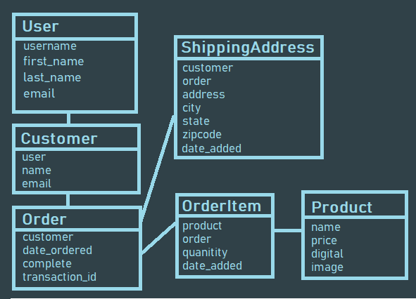
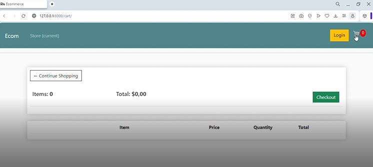
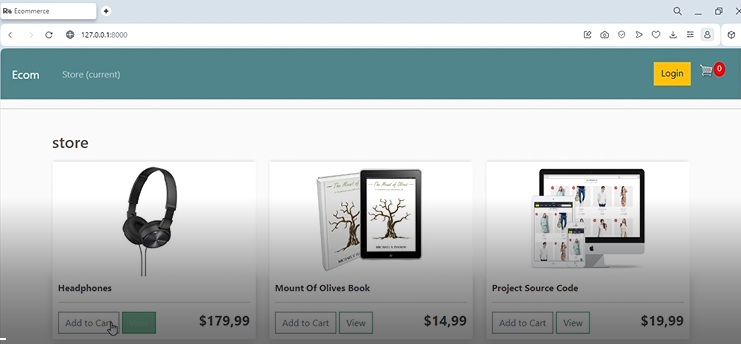
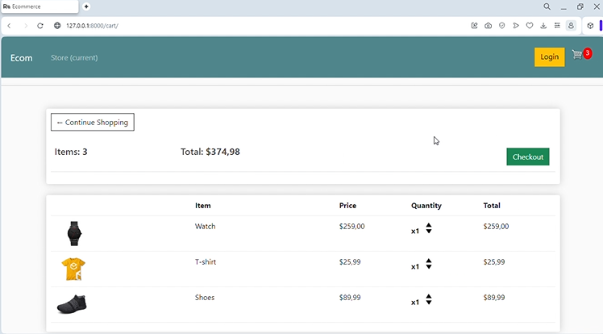
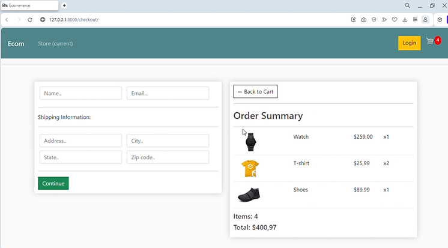

# Welcome!

***
Welcome to **Django Web Store Project**.
This project is about building a functional prototype of an online store page.
In this project, focused on **three** objectives:

1. Build data structure models.    
2. Build the shopping cart with **JavaScript** and **Python** (Django)    
3. Use **HTML** and **CSS** for user friendly interface

***

# Project Structure

The hands on project on **Django web Store Project** is divided into following tasks:

## Task 1: Configuration and creation of the data model	
	- Using classes and objects  
	- Model Migration using SQLite3 
## Task 2: Shopping cart and user interface development using Django JavaScript, HTML and CSS
	- Design user interface with HTML and CSS using Jinja Templates
	- Develop shopping cart using javascript
	- Develop application structure with django.

***
