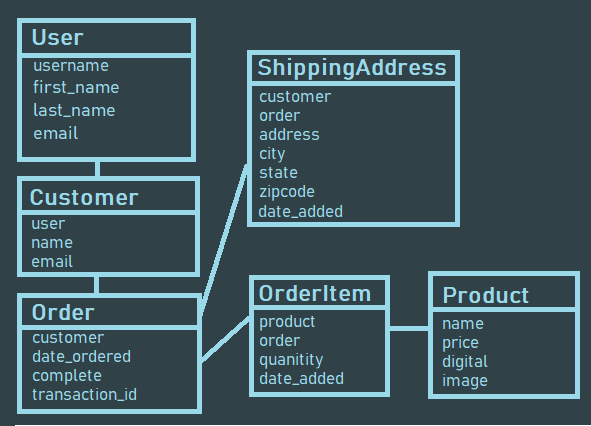
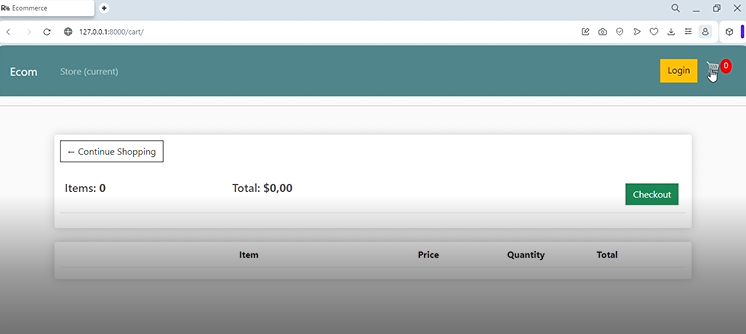
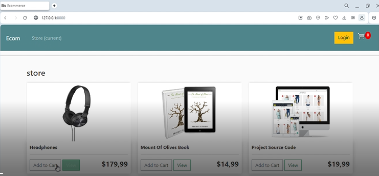
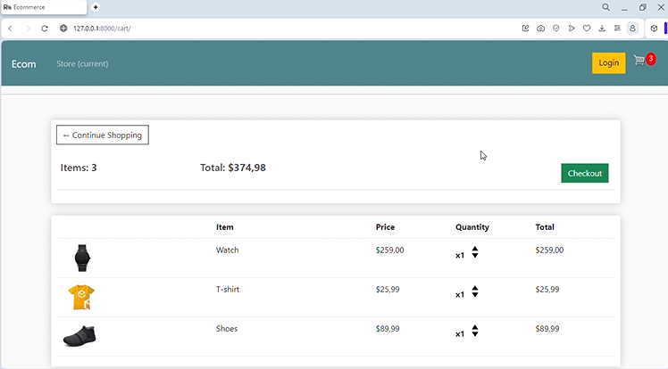
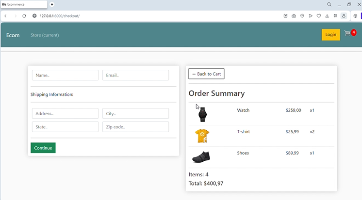

# 🛒 Django E-Commerce Web Store

https://img.shields.io/badge/Django-092E20?style=for-the-badge&logo=django&logoColor=green
A fully functional e-commerce web application prototype built with **Django**, designed to explore backend data architecture, dynamic frontend interactions, and full-stack integration. 

This project was developed as a hands-on initiative to deepen core software engineering competencies, bridge backend business logic with user interfaces, and strengthen full-stack development workflows.

# 🎯 Project Objectives & Core Focus
The project was driven by three primary technical goals:

- Robust Data Modeling: Designing and implementing structured relational data models to manage products, categories, and transactional states.
- Dynamic Shopping Cart Integration: Building a seamless cart workflow leveraging Python (Django) on the backend and JavaScript for responsive frontend state management.
- User-Centric Interface Design: Crafting an intuitive, clean user experience using HTML5, CSS3, and Django's templating engine.

# 🛠️ Project Architecture & Implementation Phases
The development process was structured into two core, hands-on milestones:

**Phase 1**: Configuration & Data Architecture
- Object-Oriented Design: Structured models using Python classes to represent store entities.
- Database Management: Configured and executed database migrations leveraging SQLite3 to ensure data integrity and persistence.

**Phase 2:** Full-Stack Integration & UI Development
- Template Engine: Designed clean, reusable interfaces using HTML, CSS, and Jinja/Django templates.
- Frontend Logic: Implemented dynamic shopping cart behaviors (adding items, updating quantities, calculating totals) using vanilla JavaScript.
- Application Architecture: Organized project routing, views, and controllers following Django’s MVT (Model-View-Template) architectural pattern.

# 💡 Key Learnings & Takeaways
Building this project provided valuable hands-on experience in:

- Translating conceptual business requirements into working database schemas using Django ORM.
- Managing state synchronization between client-side interactions (JavaScript) and server-side processing (Django).
- Establishing clean separation of concerns across a full-stack monolithic architecture.

## 🤝 Autor

**Raul Ibáñez M.**

*Freelancer Developer & Technical Lead*

📅 **2023**
